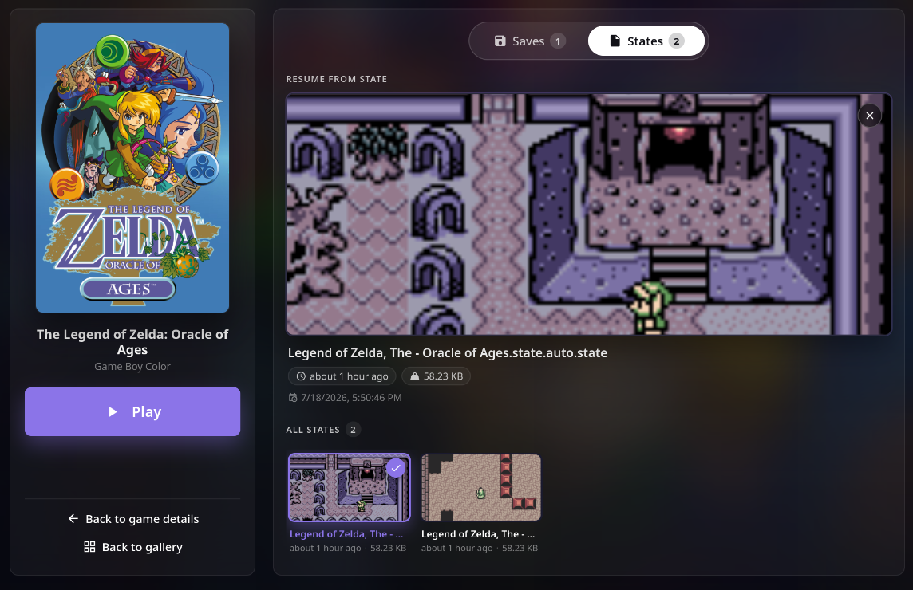

# retroarch to ROMM manager sync

This started as a simple itch: I wanted my SNES Mini's save files backed up
somewhere safer than the console itself. It's grown into a small tool that
backs up saves and states from a few handhelds into
[RomM](https://docs.romm.app/), so they're safe and playable straight from
RomM's browser emulator - every supported device happens to run a
RetroArch core under the hood, hakchi2-ce included, so one tool covers all
of them.

It's primarily a backup tool. With a RomM instance already set up, the
scripts get you going quickly - `--setup` detects which games on a device
actually have a save file and offers to map them to RomM, and every run
after that only pulls what's actually changed.

It also supports the reverse - pushing a save back down from RomM onto a
handheld, e.g. to keep playing where you left off on a different device.
That's an intentional, one-off command each time (`push` or `interactive`),
not something that happens automatically in the background. I use it
myself to move a save between my SNES Mini and Miyoo Mini: pull, then
push, whenever I actually want to switch - more like running a manual
rsync than something like Syncthing that keeps everything continuously in
sync on its own.

**Tested on:**
- **SNES Mini** (hakchi2-ce) - via USB/SSH
- **Miyoo Mini Plus** (OnionOS) - via WiFi/SSH
- **Anbernic RG34xx** (stock firmware) - via WiFi/SSH



Every device is configured under one `devices:` list in config.yaml (see
`config.example.yaml`) and can be backed up together in one run, or
targeted individually with `--device`. The SNES Mini is USB-only and
assumed always plugged in when you run a backup; the RG34xx and Miyoo Mini
are WiFi and often powered off - an unreachable device is logged as a
warning and skipped, not a failure.

Each mapped game backs up two things independently:
- **The battery/cartridge save** - the actual in-game save. This is the
  reliable part; it's core-agnostic and plays back in RomM/EmulatorJS fine.
- **Save state(s)** - backed up too, but may not load in EmulatorJS if the
  device's emulator core doesn't match RomM's (confirmed: hakchi's SNES
  core is `snes9x2010`, RomM/EmulatorJS only offer `snes9x`/`bsnes` -
  different internal state formats). Backed up anyway since some games
  (e.g. original Game Boy carts with no battery save at all) have nothing
  else to back up. Whether *all* states or just the *latest* one gets
  backed up is a per-device setting - see `state_upload_policy` under
  Retention. A game with neither a save nor a state is skipped, not an
  error.

## Three ways to run it

- **`python -m hakchi_sync`** - the main backup command. Pulls every mapped
  game on every enabled device into RomM, unattended - what you'd run on a
  schedule (cron, the Docker Compose loop). Never writes anything back to
  a device.
- **`python -m hakchi_sync.push`** - the recovery/transfer command. Pushes
  a save or state from RomM down onto one device, one game at a time -
  e.g. to restore an older save, or move progress onto a different device.
- **`python -m hakchi_sync.interactive`** - both directions above, but
  picked from a list instead of `--device`/`--rom`/`--game` flags. Useful
  when you know the game but not its exact IDs, or want to pull from one
  device and push to another in the same sitting.

## Prerequisites

### hakchi2-ce (SNES/NES Mini)

This tool only talks over SSH to a console already set up with
[hakchi2-ce](https://github.com/TeamShinkansen/hakchi2-CE) - it doesn't do
any of that setup itself. Before any of the below will work:

1. The NES/SNES Mini has already been flashed/modded with hakchi2-ce (on
   Linux this is typically run via `mono`, e.g. from a `~/hakchi2-ce`
   install directory) and has your games installed on it.
2. The console is plugged into this machine over USB. Once modded,
   hakchi2-ce's firmware exposes the console as a USB network device with
   SSH (dropbear) listening as `root`, no password required, over that
   USB link - independent of whether the hakchi2-ce GUI/tool itself is
   running. Unplugging the console removes that network interface, so it
   has to be plugged in every time you run a backup.
3. `ssh root@hakchi` (or whatever hostname/IP you use) works on its own,
   with no extra flags. If `hakchi` doesn't resolve, the console's USB
   interface usually shows up as a link-local address (`169.254.x.x`) -
   check `ip addr` / `dmesg` after plugging in, and add it to `/etc/hosts`
   as `hakchi` (or just use the IP directly as that device's `host` in
   config.yaml).

None of that is specific to this tool - it's the same connection hakchi2-ce
itself uses, and the same thing a plain `ssh root@hakchi` relies on.

### RG34xx / Miyoo Mini setup

Both are WiFi devices with SSH off by default - turn it on and note the
device's IP before configuring it here:

- **Anbernic RG34xx (stock firmware)**: Anbernic doesn't ship a menu toggle
  for SSH. The community method is a small SD-card app or script (search
  for one covering the Allwinner H700 chip family, which RG34xx shares with
  RG35XX/RG40XX) that enables dropbear; once enabled, `root`/`root` is the
  commonly documented default password. **This isn't verified against every
  RG34xx firmware revision** - if it doesn't work, you'll need to find the
  current method for your specific build.
- **Miyoo Mini / Miyoo Mini Plus (OnionOS)**: enable it on-device under
  *Apps > Tweaks > Network > SSH*. Current OnionOS defaults to
  `onion`/`onion`; older builds used `root`/`onionos` - try both if the
  first doesn't work.

Either way, once you can `ssh <user>@<device-ip>` manually, note the IP and
put the password in `.env` (see `.env.example`) rather than config.yaml.

The `roms_root`/`saves_root`/`states_root` paths in `config.example.yaml`
for both devices come from community documentation, not a guarantee for
your exact device/firmware/SD-card layout - if `--setup --device rg34xx` (or
`miyoo_mini`) finds zero games, or a `--dry-run` shows no save/state where
you know one exists, double check those three paths against what's actually
on the device (`ssh <user>@<ip> find /mnt/SDCARD/Roms` or similar) and
adjust config.yaml - no code change needed, they're all just config fields.

### RomM

You need a [RomM](https://docs.romm.app/) instance already installed,
running, and reachable on the network from wherever this tool runs (it's
not something this tool sets up or manages) - that's the `romm.base_url`
in config.yaml. If you're running the container in Docker, make sure
that's a network path the container can actually reach (not just your
host machine's browser).

## Setup

1. `pip install -r requirements.txt`
2. `cp .env.example .env` and set `ROMM_API_TOKEN` - generate it under RomM's
   Settings > API tokens (a `rmm_...` client token, not your login password).
   Add any device SSH passwords here too (see `.env.example` and the
   RG34xx/Miyoo Mini section above). `.env` is gitignored; never put secrets
   in config.yaml.
3. `cp config.example.yaml config.yaml` and fill in `romm.base_url` plus
   each device's `host` (and for RG34xx/Miyoo Mini, the `saves_root`/
   `states_root`/`roms_root` paths and `password_env`). Set `enabled: false`
   on any device you're not ready to use yet - it'll be skipped entirely
   rather than needing placeholder credentials. Leave each device's `games:`
   empty; the next step fills it in.
4. Add game mappings interactively, one device at a time:

   ```
   python -m hakchi_sync --setup --device snes_mini
   ```

   (Omit `--device` to walk every enabled device in one run.) Walks every
   game the device reports as installed that has an actual save file on it,
   one at a time. For each, it searches RomM by the game's own name/filename
   and shows candidate matches to pick by number:

   ```
   Zelda II - The Adventure of Link  (CLV-H-RPCQP)
     RomM matches for 'Zelda II - The Adventure of Link':
       1) Zelda II: The Adventure of Link (Nintendo Entertainment System) [rom 12]
     pick a number, paste a rom URL/ID, type a new search term, blank to skip, 'q' to stop: 1
     added CLV-H-RPCQP -> rom 12 (Zelda II: The Adventure of Link)
   ```

   If nothing matches (or the wrong things match), type a different search
   term to search again, or paste a rom URL (`.../rom/93`) / bare rom ID
   (`93`) directly - that gets looked up and shown for confirmation before
   it's saved. Blank skips a game for now (it'll be offered again next
   `--setup` run); `i` marks it **ignored** instead - for a game that exists
   on the device but you don't actually play there (e.g. it's backed up
   from another device already), so it's never offered or backed up again,
   and a backup run just logs that it's skipping it. `q` stops the whole
   wizard. Add `--all-roms` to also be offered games with no save file yet
   (e.g. to pre-map something you haven't played yet).

   Games already mapped (or ignored) for that device are skipped, so it's
   safe to re-run `--setup` later as you add more games.

5. Confirm each `rom_id` actually points at the game you think it does
   (`--setup` already does this per-game, but this re-checks everything):

   ```
   python -m hakchi_sync --verify-only
   ```

6. Dry run against the real device(s) (reads saves over SSH, does not
   upload):

   ```
   python -m hakchi_sync --dry-run
   ```

7. Run for real:

   ```
   python -m hakchi_sync
   ```

Add `--device snes_mini` to any command to limit it to one device, and
`--game CLV-U-NRHVN` (requires `--device`, since game ids aren't unique
across devices) to limit it to one game within that device, while testing.

## Pushing a save/state back to a device

`python -m hakchi_sync` only ever backs up (device -> RomM). To go the
other way - push whatever's in RomM back down to a device, e.g. to restore
an older save or move progress onto a different device - use:

```
python -m hakchi_sync.push --device miyoo_mini
```

`--device` is required whenever more than one device is configured. It
lists that device's mapped games, and for whichever one you pick, lets you
push its save, its state, or both. Each one shows you exactly what it's
about to overwrite (RomM's filename and timestamp) and requires a `y`
confirmation before touching the device - **this permanently overwrites
whatever's currently on the device for that game**, so make sure you're
pushing the right thing. Picks the most recently updated save/state in
RomM if there's more than one. Loops back to the game list after each push
so you can do several in one session; blank/`q` at the game picker exits.
Add `--rom 468` to skip straight to one game by its RomM rom_id instead of
picking it from the list (still asks save/state/both and confirms before
touching the device).

## Interactive mode: pull or push one game, without flags

```
python -m hakchi_sync.interactive
```

It shows every mapped rom across every device, deduplicated - so a game
mapped on more than one device (e.g. backed up from both the SNES Mini and
the Miyoo Mini) shows up once, tagged with which devices have it. Pick
one, then pick a direction and go - this real session pulls a save off the
Miyoo Mini into RomM:

```
Mapped roms:
  67)   369  The Legend of Zelda - A Link to the Past  [snes_mini, miyoo_mini]

Pick a rom, or 'q' to quit: 67

The Legend of Zelda - A Link to the Past (rom 369)
  mapped on: snes_mini, miyoo_mini
  1) pull (device -> RomM)   2) push (RomM -> device)   'b' back   'q' quit: 1
  Pull from which device?
    1) snes_mini
    2) miyoo_mini
  pick a number, or 'b' to go back: 2
  Pull (s)ave, s(t)ate, (b)oth, or blank to cancel: s
  [sram] uploaded: Legend of Zelda Link to the Past [2026-07-19_17-23-51].srm (asset id 91)
    https://retro.home/rom/369?tab=save-data&subtab=saves
```

Every uploaded save/state prints its RomM filename plus a direct link to
it in RomM's web UI, so you can jump straight there to double check it (or
grab the file yourself). If the content you just pulled happens to be
byte-identical to what's already stored, RomM's own dedup skips creating a
duplicate and you'll see the *existing* asset's (older) filename/timestamp
reflected back instead - that's RomM correctly recognizing nothing
changed, not a failure.

Staying on the same rom, you can immediately do the reverse onto a
different device - `1) pull  2) push` again, pick a device, pick
save/state/both - the same confirm-before-overwrite behavior as
`push.py`. This is exactly how you'd move progress between two devices:
pull from the one you were playing on, then push to the one you want to
play on next. `b` goes back to the rom list without leaving the program;
`q` at either prompt exits.

This is the same underlying pull (`SaveSyncService`) and push
(`PushService`) logic the main backup command and `push.py` already use -
this mode only adds the rom-first picker UX around them, so behavior
(retention, confirmation, error handling) is identical either way.

## Retention

Battery/cartridge saves go into a dedicated RomM save slot (`slot` in each
device's config, default `auto-sync`) with autocleanup on, keeping the last
`autocleanup_limit` saves in that slot. RomM also skips uploading when the
save is byte-identical to what's already in the slot, so an unplayed game
doesn't churn out duplicates.

States don't have a slot/autocleanup concept in RomM - each state upload's
filename includes which suspend point/slot it came from, so multiple states
for one game show up as separate assets rather than replacing each other.
Whether that's *every* state on the device or just the newest is
`state_upload_policy` (`all` or `latest`) per device - hakchi2-ce devices
default to `all`, stock-RetroArch devices default to `latest` to avoid
RetroArch's numbered save slots (or OnionOS's up to 10 incremental slots)
flooding RomM with uploads.

hakchi-sync also keeps a local hash cache (`.hakchi_sync_cache.json` next to
config.yaml by default) of the last-uploaded content per device/game/state,
so an unchanged save or state is skipped instead of re-uploaded every run.
Disable it with `--no-hash-cache`, or point it elsewhere with `--hash-cache
<path>`.

If two devices map the same rom_id and share the same `slot`, RomM's
per-slot dedup treats their saves as one shared history - fine as long as
you only ever play the game on one device at a time and keep RomM current
in between, but give each device its own `slot` (e.g. `auto-sync-miyoo`)
if you want their save histories kept fully separate in RomM.

## Docker

The image itself runs one backup pass and exits - it's not a server, and
doesn't listen on any port. (Docker packaging is a secondary concern here -
get a working `python -m hakchi_sync` run going first.)

### Automated, via Docker Compose

`docker-compose.yml` wraps that one-shot image in a loop so the whole thing
is self-contained - no host cron needed:

```
docker compose up -d
```

It backs up every configured device, sleeps `SYNC_INTERVAL_SECONDS`
(default 86400 = nightly), and repeats, restarting automatically via
`restart: unless-stopped` if it crashes or the host reboots. Note this
schedules "N seconds after the previous run *finishes*," not an exact
wall-clock time - fine for "roughly nightly," not for "exactly 3:00am."
Adjust the interval in `docker-compose.yml`'s `environment:` section, or
drop the loop and use the one-off form below with real host cron if you
need exact timing.

Only mount an SSH key (see the commented-out line in `docker-compose.yml`)
if some device uses `auth: publickey` in config.yaml - the SNES Mini
accepts unauthenticated root SSH by default (see Prerequisites above), and
the RG34xx/Miyoo Mini use password auth via `.env`, so most setups don't
need a mounted key at all.

### One-off, via `docker run`

For manual runs or your own host-cron entry instead of the Compose loop:

```
docker build -t hakchi-sync .
docker run --rm \
  --env-file .env \
  -v $PWD/config.yaml:/config/config.yaml:ro \
  hakchi-sync
```

```
0 3 * * * docker run --rm --env-file /path/to/.env -v /path/to/config.yaml:/config/config.yaml:ro hakchi-sync
```

Exit code is `0` on success (including when a WiFi device was simply
offline - that's a per-device warning, not a failure), `1` if any game
actually failed to upload, `2` on a config error.
